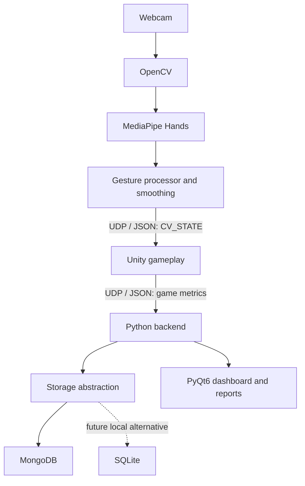

# MotionPlay

An experimental computer-vision motion gaming platform designed to demonstrate how webcam-based movement tracking can be combined with interactive games, performance analytics, and adaptive difficulty.

**Portfolio/educational project. Not a medical device.** MotionPlay does not provide clinical rehabilitation, diagnosis, or treatment. Future reports will describe gameplay performance metrics, not medical improvement.

## Current status: Phase 9

This is an original implementation. Phase 1 provides the Python package structure, validated `.env` configuration, rotating local logs, an import health check, and foundation tests. Phase 2 adds webcam capture, MediaPipe Hands, reusable hand observations, and a local landmark preview. Phase 3 adds bounded palm-center control coordinates, EMA smoothing, a dead zone, handedness-confidence gating, and tracking-loss timeouts. Phase 4 adds reusable gesture classification and per-hand debouncing for `OPEN_HAND`, `FIST`, `PINCH`, `POINT`, and `UNKNOWN`. Phase 5 adds a paced Python UDP sender, a validated `CV_STATE` JSON protocol, and a local packet monitor. Phase 6 adds a minimal Unity project, a threaded UDP receiver with packet validation, sequence ordering, receive timeout, and a numerical diagnostic panel. Phase 7 adds a hand-controlled geometric cursor with mirror-aware coordinate mapping, camera bounds, and visibility tied to fresh tracking. Phase 8 adds Reach Garden, a first game where you hold the cursor on geometric flowers to water them (see [Phase 8](docs/phase8_reach_garden.md)). Phase 9 adds in-memory round statistics (accuracy, streaks, reaction and movement time, hold stability, path efficiency) shown after each round (see [Phase 9](docs/phase9_session_stats.md)). Saving results, databases, authentication, and the dashboard are **not implemented yet**.

Cloud checks cover the Python pipeline, compiled engine-independent C# receiver/mapping, and real Python-to-C# UDP delivery with cursor-coordinate assertions. Unity Editor, Windows Play Mode, and live webcam verification remain pending.

The first milestone now has its webcam → Python/OpenCV/MediaPipe → UDP → Unity cursor implementation. Verify it reliably on your Windows computer before building the first game, **Reach Garden**; Unity/live webcam validation is still pending.

## Planned architecture



Python will own computer vision, Unity will own gameplay, the backend will own persistent session data, and PyQt6 will provide the desktop interface. These responsibilities remain separate so future games can reuse tracking.

## Setup and usage

Use **64-bit Python 3.11**. Windows 11 is the primary local target. Run these commands from the project directory in PowerShell:

```powershell
py -3.11 -m venv .venv
.\.venv\Scripts\python.exe -m pip install --upgrade pip
.\.venv\Scripts\python.exe -m pip install -r requirements.txt
Copy-Item .env.example .env
.\.venv\Scripts\python.exe -m app.health_check
.\.venv\Scripts\python.exe -m unittest discover -s tests -v
```

Explicitly invoking the virtual environment avoids PowerShell activation policy issues. See [setup and troubleshooting](docs/setup.md) for Linux/cloud commands and error guidance.

The health check verifies Python 3.11, OpenCV, MediaPipe, PyQt6 widgets, PyMongo, NumPy, python-dotenv, bcrypt, Matplotlib, configuration, and logging. It returns exit code `1` if a check fails. It does not open a webcam or desktop window, start Unity, or contact MongoDB.

Direct dependencies are pinned in `requirements.txt`. OpenCV is supplied by `opencv-contrib-python`, which MediaPipe already requires, avoiding competing `cv2` installations. MediaPipe `0.10.21` is selected for its `mp.solutions.hands` API; newer MediaPipe releases use a different API. Transitive dependencies are resolver-selected, so this is not yet a complete dependency lock.

### Run the Phase 5 webcam pipeline

With the environment ready, run from the project root on Windows:

```powershell
.\.venv\Scripts\python.exe -m cv_engine.controller
```

Show your hand to the webcam. The preview draws all 21 landmarks, including wrist, fingertips, and MCP joints, and displays the physical left/right hand label, loop FPS, and MediaPipe processing time. A **white circle** marks the unfiltered palm center; a **magenta cross** marks the smoothed control position. Control X/Y remain between zero and one. Missing or rejected observations expose no active control position, and the filter resets after the configured tracking timeout. Press **Q**, **Escape**, or close the window to stop. No footage is recorded or transmitted; filtered numerical hand states are sent over UDP to localhost by default. Set `CAMERA_INDEX=1` in `.env` if your preferred webcam is the second camera.

The preview also shows each hand's **raw candidate**, **confirmed gesture**, and consecutive-frame count. Five consecutive accepted frames confirm a change by default. A missing/low-confidence hand or unusable geometry immediately clears its gesture state. These are configurable geometric heuristics; real webcam recognition still requires local validation.

For an attached camera without a preview window:

```powershell
.\.venv\Scripts\python.exe -m cv_engine.controller --no-preview --max-frames 300
```

Headless mode still requires a camera; it is not a simulated webcam. See [Phase 2 capture and tracking](docs/phase2_hand_tracking.md), [Phase 3 filtering](docs/phase3_coordinates.md), [Phase 4 gesture rules](docs/phase4_gestures.md), and [Phase 5 UDP acceptance checks](docs/phase5_udp_sender.md).

### Verify UDP delivery before Unity

Start this in a separate PowerShell terminal before the CV engine:

```powershell
.\.venv\Scripts\python.exe -m app.udp_monitor --timeout 120
```

The monitor prints received `CV_STATE` packets on localhost port 5005. `CONTROL_HAND=right` selects the physical hand; set `left` in `.env` if needed. Packets contain filtered position and confirmed gesture, or an explicit lost state with null position. The sender targets 30 Hz, skips excess frames, and never queues stale states. OS-accepted sends do not prove delivery. Use `--no-udp` on the CV engine for local-only preview. See [UDP protocol](docs/udp_protocol.md) and the [Windows test guide](docs/phase5_udp_sender.md).

### Run Reach Garden (Phase 8)

With the Phase 7 cursor working, click **MotionPlay → Create Reach Garden Scene** in Unity, press **Play**, and start the Python CV engine. Hold the cursor on each flower to water it. Setup and the acceptance checklist are in the [Phase 8 guide](docs/phase8_reach_garden.md).

### Run the Phase 7 hand cursor

In Unity Hub, add the repository's **`unity/MotionPlay`** folder and open it with **Unity 2022.3.62f3**. After packages restore and scripts compile, click **MotionPlay → Create Hand Cursor Test Scene**, then **Play**. Start the Python CV engine in PowerShell. A simple disc follows the filtered palm position, stays inside the orthographic view, and hides on hand loss or receive timeout. Mirroring uses the packet flag to avoid applying the flip twice. Expand diagnostics to inspect received states.

Close the Python packet monitor first; Unity needs exclusive ownership of the receive port. See the [Phase 7 setup and proof-of-concept checklist](docs/phase7_hand_cursor.md). The [Phase 6 receiver scene](docs/phase6_unity_receiver.md) remains available via **MotionPlay → Create Receiver Test Scene** for independent receiver checks.

## Repository layout

```text
app/          Health check and local UDP diagnostic monitor
cv_engine/    Capture, tracking, palm filtering, gestures, preview, UDP sender
backend/      Reserved for storage, sessions, authentication, and difficulty
shared/       Configuration, logging, and wire protocol
unity/        Unity receiver, hand cursor, diagnostic scenes, core and Play Mode tests
tests/        Hardware-independent unit and loopback integration tests
docs/         Setup notes; architecture and protocol docs added with implementation
```

## Configuration and logging

Copy `.env.example` to `.env` for local overrides. Settings load in this order: defaults, project `.env`, process environment. The loader does not mutate process variables. Relative log paths resolve from the project root. Invalid log levels, empty settings, malformed/out-of-range ports, equal send/receive ports, and unsupported MongoDB URI schemes produce helpful errors.

UDP uses the literal IPv4 destination `UDP_HOST=127.0.0.1`. Port `5005` receives CV states; port `5006` is reserved for future Unity results. `UDP_SEND_FPS=30` sets the target cadence and `CONTROL_HAND=right` selects the hand. Invalid sender settings are rejected before device access. Unity independently loads the selected port settings and `UNITY_RECEIVE_TIMEOUT=0.5` from the repository `.env` in the Editor, with process-environment overrides. MongoDB defaults to a local instance; Phase 1 checks the URI scheme only, not database availability or credentials. Put credentials in `.env`, never in source code. `.env`, environments, logs, recordings, and local database files are ignored by Git.

Runtime logs go to `logs/motionplay.log`, with a 2 MiB limit per file and three rotated backups. Configure the `motionplay` logger once at an application entry point; components can use child loggers such as `motionplay.cv_engine`. Do not log credentials or webcam frames.

## Privacy

Webcam frames stay local. The CV pipeline holds frames in memory for processing and optional preview, with no recording or image transmission. UDP contains numerical hand states only and defaults to localhost. Setting a remote `UDP_HOST` sends those states to that host; `--no-udp` disables transmission. Logs contain startup events, tracking transitions, confirmed gesture names, timing summaries, UDP counters, and errors rather than images or landmarks. Future persistent gameplay data will contain numerical session metrics. Installing dependencies requires network access; the selected hand models are bundled with MediaPipe.

## Receiver testing

Python tests run as before. The optional .NET 8 developer harness compiles the same networking core and NUnit tests used by Unity:

```powershell
dotnet run --project tests/csharp/MotionPlay.ReceiverHarness.csproj -- --noresult
.\.venv\Scripts\python.exe -m tests.check_python_unity_udp
```

The harness does not require Unity or a webcam. Unity itself supplies Json.NET through its official package and NUnit through Test Framework; .NET 8 is not required to run MotionPlay in Unity. The standalone suite has 96 C# cases, including 21 cursor mapping cases, 15 Reach Garden rule cases, and 9 session statistics cases. See the [Phase 7 guide](docs/phase7_hand_cursor.md) for Unity EditMode/PlayMode instructions and the local checks needed before gameplay.

## Development sequence

1. Repository and Python environment (**complete**).
2. Webcam and MediaPipe hand tracking (**implemented; local webcam verification pending**).
3. Coordinate normalization and smoothing (**implemented; local webcam verification pending**).
4. Gesture engine (**implemented; local webcam verification pending**).
5. Python UDP sender (**implemented; live Windows webcam delivery pending**).
6. Unity UDP receiver (**implemented; Unity Editor/Windows verification pending**).
7. Hand-controlled Unity cursor (**implemented; local proof-of-concept validation pending**).
8. Reach Garden gameplay using geometric placeholders (**implemented; Unity Editor/live play verification pending**).
9. Session statistics.
10. Unity results sent to Python.
11. Database abstraction and MongoDB.
12. User authentication.
13. PyQt6 dashboard.
14. Progress reports.
15. Adaptive difficulty.
16. Broader automated testing (tests also accompany earlier functionality).
17. Expanded logging and error handling.
18. Installer and startup scripts.
19. Complete README and architecture documentation.
20. Portfolio polish.

Demo footage, screenshots, database schemas, performance measurements, challenges, and lessons learned will be added when the corresponding functionality exists. Reach Garden and future games will use original code, mechanics, and assets; no source, artwork, or UI is copied from other projects.
