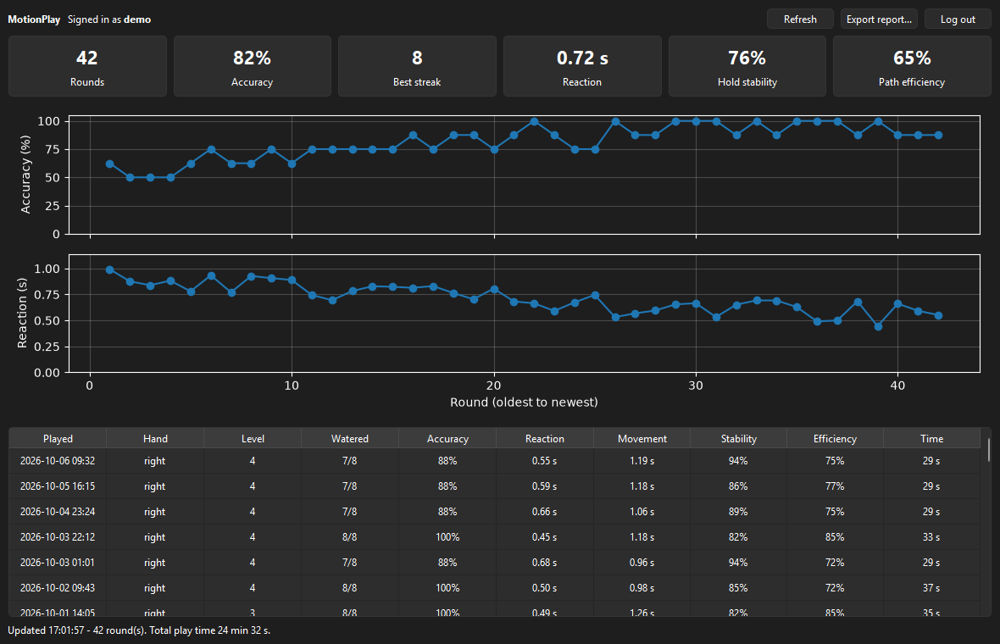
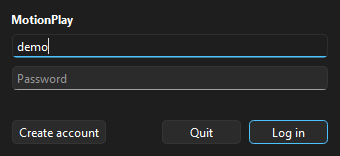
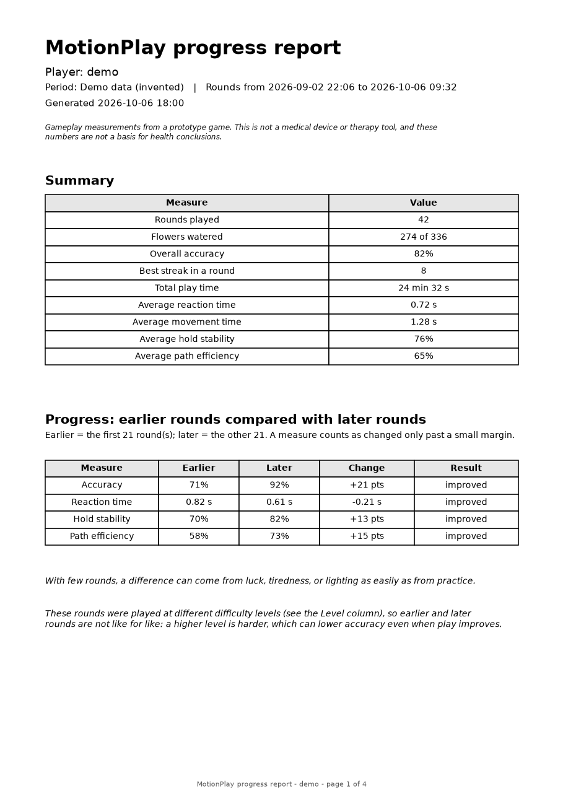
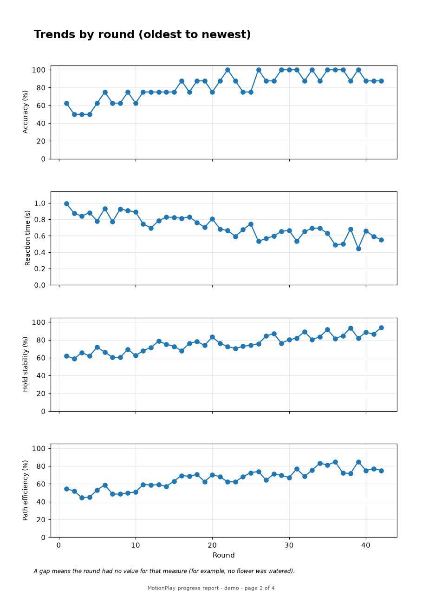
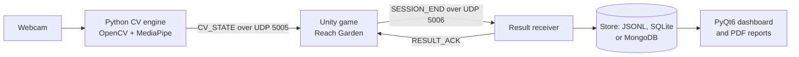

# MotionPlay

MotionPlay turns a webcam into a game controller. Python tracks your hand with OpenCV and MediaPipe and streams its position to a Unity game, where you hold a
cursor on geometric flowers to water them. Each finished round is measured, saved, and shown on a desktop dashboard and in PDF progress reports, and the game adapts its difficulty
to how you are doing.

It is an experimental portfolio project built to show how webcam-based movement tracking can be combined with interactive games, performance analytics, and adaptive difficulty.

**Portfolio and educational project. Not a medical device.** MotionPlay does not provide clinical rehabilitation, diagnosis, or treatment. Its reports describe gameplay performance
numbers from a prototype game, not medical improvement, and are not a basis for health conclusions.

## What it does

- **Hand tracking to a cursor.** Webcam, then MediaPipe Hands, then palm position with smoothing and label-flicker correction, sent about 30 times a second over UDP. Only numbers leave the process; frames never do.
- **A first game, Reach Garden.** Eight flowers per round; hold the cursor on each to water it. Original geometric placeholders, no copied art or code.
- **Round statistics.** Accuracy, streaks, reaction and movement time, hold stability, and path efficiency.
- **Adaptive difficulty.** Five levels that move up or down after two qualifying rounds, with manual override.
- **Reliable result saving.** Each round is sent to a Python receiver, acknowledged, retried if needed, and stored exactly once (JSONL, SQLite, or MongoDB).
- **Players and a dashboard.** Local accounts with bcrypt passwords, and a PyQt6 dashboard of your rounds, charts, and a PDF progress report.
- **Windows setup and start scripts** with double-click launchers, and a large automated test suite that needs no hardware.

## Highlights

- **Two processes, one small protocol.** Vision in Python, gameplay in Unity, joined by two UDP messages: a lossy "latest wins" hand-state stream and an acknowledged, idempotent result message, each with the delivery guarantee it needs.
- **Logic you can test without hardware.** Rules, statistics, difficulty and retry bookkeeping are engine-free, so 118 C# tests run the same source files Unity compiles, alongside 355 Python tests at 96% coverage.
- **Problems found and fixed with data, not guesses.** A vanishing cursor was traced to MediaPipe's left/right label flipping during motion and fixed with a continuity stage; a 6 to 29 second camera start was found by logging and cut to about 2.6 s. The [retrospective](docs/lessons-learned.md) tells it honestly, including the wrong turns.
- **Honest about limits.** The [performance write-up](docs/performance.md) says what was and was not measured, and the status table below says what has been checked on real hardware.
- **Documentation that is tested.** Links, diagrams and the configuration reference are checked against the code on every run.

## Screenshots

The images below are generated from **invented demo data** (an imaginary player named `demo`) by `tools/make_demo_assets.py`; they show the real interface, not real play. A short clip of the game and a picture of the hand
tracking need a camera and Unity, so they are not included yet ([how to add them](docs/demo-guide.md)).

| Dashboard | Login |
|---|---|
|  |  |

| Report: summary and progress | Report: trends |
|---|---|
|  |  |

The full [sample report (PDF)](docs/images/sample-report.pdf) is generated from the same demo data.

<!-- After recording (see docs/demo-guide.md), remove the comment markers and keep the lines you have files for:


-->


## How it fits together



Python owns computer vision and data, Unity owns gameplay, and they meet only through two small UDP messages. The reasons for each choice, the data flow in detail, and the limits are in the
[architecture document](docs/architecture.md).

## Quick start (Windows)

1. Install **64-bit Python 3.11** (python.org, with the py launcher) and **Unity 2022.3.62f3**.
2. Double-click **`MotionPlay-Setup.cmd`**. It builds the Python environment, creates `.env`, and runs the health check (about 4 minutes the first time).
3. Create a player (asks for a password twice): `.\.venv\Scripts\python.exe -m backend.users create <name>`
4. Open `unity\MotionPlay` in Unity. The first time, click **MotionPlay > Create Reach Garden Scene**, then press **Play**.
5. Double-click **`MotionPlay-Start.cmd`** (or run `.\scripts\start.ps1 -User <name>`). It opens the result receiver and the CV engine; type your password in the receiver window.
6. Show your hand to the camera. A round starts when your hand first appears.

`MotionPlay-Test.cmd` runs every automated check. Options for all three launchers are in the [Phase 18 guide](docs/phase18_setup_scripts.md).

### Controls

| Where | Key or action | Effect |
|---|---|---|
| In the game | Move your hand | Moves the cursor |
| In the game | Hold the cursor on a flower | Waters it |
| In the game | Hold on the blue circle, or **R** | Starts a new round |
| In the game | **[** and **]** | Lower or raise the difficulty level (on the waiting and summary screens only) |
| CV engine window | **Q** or **Esc** (no preview window), or **Ctrl+C** | Stops the engine |
| Receiver window | **Ctrl+C** | Stops the receiver |

## Using MotionPlay

**See your history.** `python -m app.dashboard` logs a player in and shows their rounds, charts, and an **Export report** button; it refreshes by itself as rounds arrive ([Phase 13](docs/phase13_dashboard.md)).
For a report without the window: `.\.venv\Scripts\python.exe -m app.report --user <name> --days 30` writes a PDF to `reports\` ([Phase 14](docs/phase14_reports.md)).

**Work with saved rounds.** `python -m backend.sessions list --user <name>` lists rounds; `import` copies a JSONL file into SQLite; `claim` gives older unassigned rounds to a player. Choose where results are kept
with `--store jsonl|sqlite|mongo` ([Phase 11](docs/phase11_storage.md), [accounts](docs/phase12_accounts.md)).

**Check the pieces separately.** `python -m cv_engine.controller` alone shows the camera preview with landmarks and gestures; `python -m app.udp_monitor` prints the hand-state packets so you can confirm delivery before Unity
([Phases 2 to 5](docs/phase2_hand_tracking.md), [UDP protocol](docs/udp_protocol.md)). Close the monitor before starting Unity, which needs the port to itself.

**Run the commands by hand** (the scripts just do this for you):

```powershell
.\.venv\Scripts\python.exe -m backend.result_receiver --store sqlite --user <name>   # one window
.\.venv\Scripts\python.exe -m cv_engine.controller --no-preview                      # another window
```

## Requirements

- Windows 11 is the primary target. Python 3.11 (64-bit); MediaPipe 0.10.21 is pinned for its `mp.solutions.hands` API, and later releases use a different one.
- Unity 2022.3.62f3 for the game. Unity supplies Json.NET and NUnit itself.
- A webcam. No MongoDB server is needed; SQLite and JSONL need nothing extra.
- Direct dependencies are pinned in `requirements.txt` (transitive ones are resolver-chosen, so it is not a full lock). OpenCV comes from `opencv-contrib-python`, which MediaPipe already requires.
- Linux and cloud setup commands, and troubleshooting, are in [setup](docs/setup.md). The scripts and the camera backend are Windows-specific.

## Repository layout

```text
app/          Health check, UDP monitor, PyQt6 dashboard, PDF progress reports
backend/      Result receiver, storage (JSONL/SQLite/MongoDB), accounts, session tools
cv_engine/    Camera, MediaPipe, label continuity, palm filtering, gestures, preview, UDP sender
shared/       Configuration, logging, and the wire protocol
unity/        The Unity project: receiver, hand cursor, Reach Garden, and its Editor and tests
scripts/      Windows setup, start, and test scripts (with MotionPlay-*.cmd launchers in the root)
tests/        Hardware-free unit, integration, and loopback tests, plus the C# test harness
docs/         Architecture, configuration, protocol, and one guide per phase
```

## Configuration and logging

Copy `.env.example` to `.env` (setup does this). Settings load in order: defaults, `.env`, then environment variables; invalid values are rejected with the setting's name before any camera or socket is opened.
Every setting, its default, and its valid range is in the [configuration reference](docs/configuration.md). `.env`, virtual environments, logs, and local databases are ignored by Git; put credentials only in `.env`.

Every working command writes to `logs/motionplay.log` (2 MiB per file, three backups). Uncaught errors are recorded with a traceback, and each run logs its start-up timings and a summary, including how long the camera took to open
([Phase 17](docs/phase17_logging.md)).

## Privacy

Webcam frames stay in memory for processing and the optional preview; nothing is recorded or sent as an image. UDP carries numerical hand states only and defaults to localhost; a remote `UDP_HOST` sends those numbers to that host, and
`--no-udp` turns sending off. Logs hold timings, transitions, gesture names, counters and errors, not images or landmarks, and never passwords or connection strings. Saved rounds are numerical statistics stored on this machine, along with
bcrypt password hashes for player accounts. Installing dependencies needs network access; MediaPipe's hand models are bundled with it.

## Testing

```powershell
.\MotionPlay-Test.cmd            # everything below, with a summary
.\.venv\Scripts\python.exe -m unittest discover -s tests
dotnet run --project tests/csharp/MotionPlay.ReceiverHarness.csproj -- --noresult
.\.venv\Scripts\python.exe -m tests.check_python_unity_udp
```

At the time of writing: **355 Python tests** (96% line and branch coverage), **118 C# tests** that compile the same source files Unity runs, and a real Python-to-C# UDP check. None needs a webcam, Unity, or a database server.
What cannot be automated (the Unity Editor and Play Mode, the live webcam, a real MongoDB server, real-display rendering) has a manual checklist in each phase guide. See [Phase 16](docs/phase16_testing.md).

## Project status

Developed and tested on one Windows 11 PC with one webcam. "Live" means exercised on that hardware with real play, as opposed to automated tests alone.

| # | Phase | Guide | Verification |
|---|---|---|---|
| 1 | Repository, environment, configuration, logging | [setup](docs/setup.md) | Complete |
| 2 | Webcam capture and MediaPipe hand tracking | [guide](docs/phase2_hand_tracking.md) | Live |
| 3 | Palm coordinates and smoothing | [guide](docs/phase3_coordinates.md) | Live |
| 4 | Gesture rules and debouncing | [guide](docs/phase4_gestures.md) | Live; geometric heuristics, accuracy not benchmarked |
| 5 | Python UDP sender | [guide](docs/phase5_udp_sender.md) | Live |
| 6 | Unity UDP receiver | [guide](docs/phase6_unity_receiver.md) | Live |
| 7 | Hand-controlled Unity cursor | [guide](docs/phase7_hand_cursor.md) | Live |
| 8 | Reach Garden gameplay | [guide](docs/phase8_reach_garden.md) | Live |
| 9 | Round statistics | [guide](docs/phase9_session_stats.md) | Live |
| 10 | Result delivery from Unity to Python | [guide](docs/phase10_result_delivery.md) | Live |
| 11 | Storage (JSONL, SQLite, MongoDB) | [guide](docs/phase11_storage.md) | JSONL and SQLite live; MongoDB only against a stand-in |
| 12 | Player accounts | [guide](docs/phase12_accounts.md) | Login live; lockout and the rest automated |
| 13 | PyQt6 dashboard | [guide](docs/phase13_dashboard.md) | Automated and data path checked; visual check on a real display pending |
| 14 | PDF progress reports | [guide](docs/phase14_reports.md) | Automated; PDF not yet checked by eye in a viewer |
| 15 | Adaptive difficulty | [guide](docs/phase15_adaptive_difficulty.md) | Level up and manual keys live; the automatic level drop is not yet confirmed live |
| 16 | Broader automated testing | [guide](docs/phase16_testing.md) | Complete |
| 17 | Expanded logging and error handling | [guide](docs/phase17_logging.md) | Complete; observed in live runs |
| 18 | Windows setup, start and test scripts | [guide](docs/phase18_setup_scripts.md) | From-scratch install and real launch checked |
| 19 | Complete README and architecture documentation | [architecture](docs/architecture.md) | This phase |
| 20 | Portfolio polish | [performance](docs/performance.md), [lessons](docs/lessons-learned.md), [demo guide](docs/demo-guide.md) | Generated screenshots, charts, retrospective and changelog done; a game clip and a tracking screenshot still need your camera and Unity |

Beyond the phases, two problems found in live play were fixed along the way: tracking flicker from MediaPipe's left/right label flipping ([continuity fix](docs/phase3_coordinates.md)) and a camera that took 6 to 29 seconds
to open ([DirectShow backend](docs/phase2_hand_tracking.md)).

### Known limitations

One tested machine and webcam; brief tracking flicker remains; one game, and gestures are detected but unused by it; the camera ends the engine on a failed read; difficulty is stored per machine, not per player; no continuous-integration
workflow; Windows-only scripts. The full list, with reasons, is in the [architecture document](docs/architecture.md#13-known-limitations).

## Documentation

| Read this | For |
|---|---|
| [Architecture](docs/architecture.md) | How the system fits together, why, and its limits |
| [Configuration reference](docs/configuration.md) | Every `.env` setting |
| [UDP protocol](docs/udp_protocol.md) | The exact `CV_STATE`, `SESSION_END`, and `RESULT_ACK` packets |
| [Setup and troubleshooting](docs/setup.md) | Manual setup, Linux and cloud notes, common failures |
| [Performance](docs/performance.md) | What was measured on the development PC, with charts, and what was not |
| [Challenges and lessons learned](docs/lessons-learned.md) | The hardest problems, how they were found, and what they taught |
| [Recording the demo](docs/demo-guide.md) | How to add a game clip and a tracking screenshot |
| [Changelog](CHANGELOG.md) | What changed, by phase |
| Phase guides (2 to 18) | How each part works and a checklist to verify it |

Reach Garden and any future games use original code, mechanics, and assets; no source, artwork, or UI is copied from other projects.
