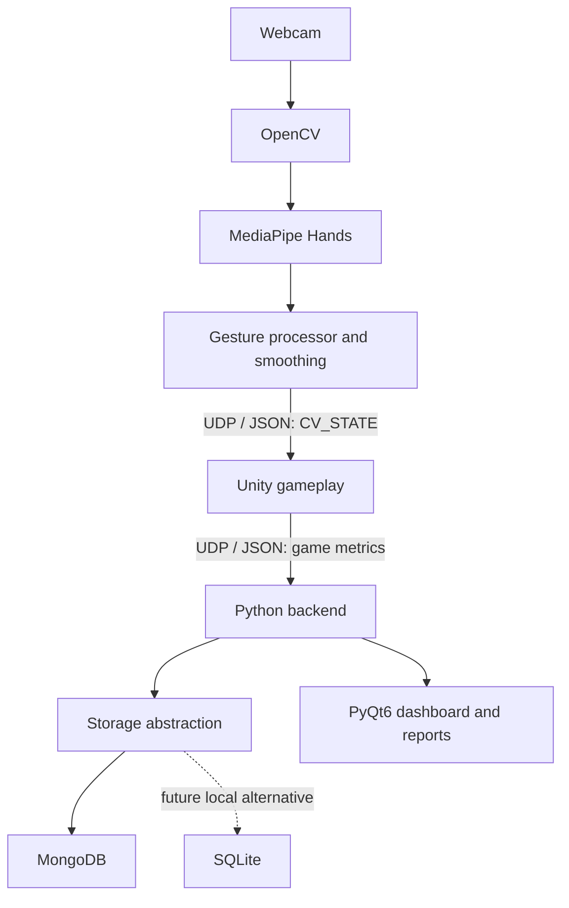

# MotionPlay

An experimental computer-vision motion gaming platform designed to demonstrate how webcam-based movement tracking can be combined with interactive games, performance analytics, and adaptive difficulty.

**Portfolio/educational project. Not a medical device.** MotionPlay does not provide clinical rehabilitation, diagnosis, or treatment. Future reports will describe gameplay performance metrics, not medical improvement.

## Current status: Phase 4

This is an original implementation. Phase 1 provides the Python package structure, validated `.env` configuration, rotating local logs, an import health check, and foundation tests. Phase 2 adds webcam capture, MediaPipe Hands, reusable hand observations, and a local landmark preview. Phase 3 adds bounded palm-center control coordinates, EMA smoothing, a dead zone, handedness-confidence gating, and tracking-loss timeouts. Phase 4 adds reusable gesture classification and per-hand debouncing for `OPEN_HAND`, `FIST`, `PINCH`, `POINT`, and `UNKNOWN`. Networking, Unity gameplay, databases, authentication, and the dashboard are **not implemented yet**.

The cloud checks cover synthetic inputs and resource/error handling. Live tracking still requires verification on a local webcam before calling this phase hardware-validated.

The first milestone will connect a local webcam through Python/OpenCV/MediaPipe and UDP to a hand-controlled Unity cursor. Reliability of that milestone must be verified before building the first game, **Reach Garden**.

## Planned architecture



Python will own computer vision, Unity will own gameplay, the backend will own persistent session data, and PyQt6 will provide the desktop interface. These responsibilities remain separate so future games can reuse tracking.

## Setup and usage

Use **64-bit Python 3.11**. Windows 11 is the primary local target. Run these commands from the project directory in PowerShell:

```powershell
py -3.11 -m venv .venv
.\.venv\Scripts\python.exe -m pip install --upgrade pip
.\.venv\Scripts\python.exe -m pip install -r requirements.txt
Copy-Item .env.example .env
.\.venv\Scripts\python.exe -m app.health_check
.\.venv\Scripts\python.exe -m unittest discover -s tests -v
```

Explicitly invoking the virtual environment avoids PowerShell activation policy issues. See [setup and troubleshooting](docs/setup.md) for Linux/cloud commands and error guidance.

The health check verifies Python 3.11, OpenCV, MediaPipe, PyQt6 widgets, PyMongo, NumPy, python-dotenv, bcrypt, Matplotlib, configuration, and logging. It returns exit code `1` if a check fails. It does not open a webcam or desktop window, start Unity, or contact MongoDB.

Direct dependencies are pinned in `requirements.txt`. OpenCV is supplied by `opencv-contrib-python`, which MediaPipe already requires, avoiding competing `cv2` installations. MediaPipe `0.10.21` is selected for its `mp.solutions.hands` API; newer MediaPipe releases use a different API. Transitive dependencies are resolver-selected, so this is not yet a complete dependency lock.

### Run the Phase 4 webcam preview

With the environment ready, run from the project root on Windows:

```powershell
.\.venv\Scripts\python.exe -m cv_engine.controller
```

Show your hand to the webcam. The preview draws all 21 landmarks, including wrist, fingertips, and MCP joints, and displays the physical left/right hand label, loop FPS, and MediaPipe processing time. A **white circle** marks the unfiltered palm center; a **magenta cross** marks the smoothed control position. Control X/Y remain between zero and one. Missing or rejected observations expose no active control position, and the filter resets after the configured tracking timeout. Press **Q**, **Escape**, or close the window to stop. No footage is recorded or transmitted. Set `CAMERA_INDEX=1` in `.env` if your preferred webcam is the second camera.

The preview also shows each hand's **raw candidate**, **confirmed gesture**, and consecutive-frame count. Five consecutive accepted frames confirm a change by default. A missing/low-confidence hand or unusable geometry immediately clears its gesture state. These are configurable geometric heuristics; real webcam recognition still requires local validation.

For an attached camera without a preview window:

```powershell
.\.venv\Scripts\python.exe -m cv_engine.controller --no-preview --max-frames 300
```

Headless mode still requires a camera; it is not a simulated webcam. See [Phase 2 capture and tracking](docs/phase2_hand_tracking.md), [Phase 3 filtering](docs/phase3_coordinates.md), and [Phase 4 gesture rules, tuning, and acceptance checks](docs/phase4_gestures.md).

## Repository layout

```text
app/          Application entry points; health check implemented
cv_engine/    Capture, tracking, palm filtering, gestures, debouncing, local preview
backend/      Reserved for storage, sessions, authentication, and difficulty
shared/       Configuration and logging
tests/        Hardware-independent foundation tests
docs/         Setup notes; architecture and protocol docs added with implementation
```

## Configuration and logging

Copy `.env.example` to `.env` for local overrides. Settings load in this order: defaults, project `.env`, process environment. The loader does not mutate process variables. Relative log paths resolve from the project root. Invalid log levels, empty settings, malformed/out-of-range ports, equal send/receive ports, and unsupported MongoDB URI schemes produce helpful errors.

UDP defaults are localhost ports `5005` and `5006`; these are reserved for future phases. MongoDB defaults to a local instance; Phase 1 checks the URI scheme only, not database availability or credentials. Put credentials in `.env`, never in source code. `.env`, environments, logs, recordings, and local database files are ignored by Git.

Runtime logs go to `logs/motionplay.log`, with a 2 MiB limit per file and three rotated backups. Configure the `motionplay` logger once at an application entry point; components can use child loggers such as `motionplay.cv_engine`. Do not log credentials or webcam frames.

## Privacy

Webcam frames stay local. The CV pipeline holds frames in memory for processing and optional preview, with no recording or network transmission. Logs contain startup events, tracking transitions, confirmed gesture names, timing summaries, and errors rather than images or landmarks. Future persistent gameplay data will contain numerical session metrics. Installing dependencies requires network access; the selected hand models are bundled with MediaPipe.

## Development sequence

1. Repository and Python environment (**complete**).
2. Webcam and MediaPipe hand tracking (**implemented; local webcam verification pending**).
3. Coordinate normalization and smoothing (**implemented; local webcam verification pending**).
4. Gesture engine (**implemented; local webcam verification pending**).
5. Python UDP sender.
6. Unity UDP receiver.
7. Hand-controlled Unity cursor; verify the proof of concept.
8. Reach Garden gameplay using geometric placeholders.
9. Session statistics.
10. Unity results sent to Python.
11. Database abstraction and MongoDB.
12. User authentication.
13. PyQt6 dashboard.
14. Progress reports.
15. Adaptive difficulty.
16. Broader automated testing (tests also accompany earlier functionality).
17. Expanded logging and error handling.
18. Installer and startup scripts.
19. Complete README and architecture documentation.
20. Portfolio polish.

Demo footage, screenshots, UDP specifications, database schemas, performance measurements, challenges, and lessons learned will be added when the corresponding functionality exists. Reach Garden and future games will use original code, mechanics, and assets; no source, artwork, or UI is copied from other projects.
