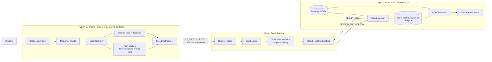
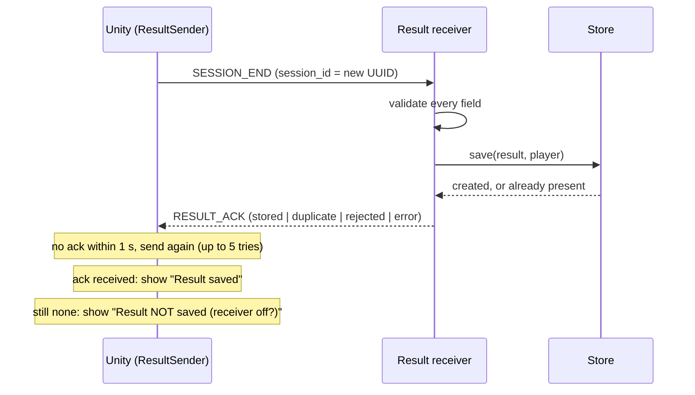

# MotionPlay architecture

MotionPlay turns a webcam into a game controller. A Python program reads the camera and works out where your hand is; a Unity game uses that
position to play; a second Python program saves each finished round; and a desktop dashboard shows your history. This document explains how the pieces fit,
why they are built that way, and where the limits are. For setup and day-to-day use, start with the [README](../README.md).

Figures quoted here (test counts, frame rates, timings) were measured on the development machine, a Windows 11 PC with one webcam, at the time of writing.

## 1. Design goals

1. **Separate vision from gameplay.** Computer vision (Python, OpenCV, MediaPipe) and gameplay (Unity) are different processes joined by a small, documented
   protocol. A future game reuses the tracking unchanged, and tracking can be tested without Unity.
2. **Make the logic testable without hardware.** Anything that decides something (smoothing, label correction, game rules, statistics, difficulty, retry
   bookkeeping) is plain code with no camera, socket or engine types, tested directly. The same C# source files Unity runs are compiled and tested outside Unity.
3. **Survive an unreliable link.** UDP can drop, reorder and duplicate packets. The design assumes this: hand states are "latest wins", and results are
   delivered at least once and stored exactly once.
4. **Keep the camera private.** Frames never leave the CV process. Only numbers are sent, to localhost by default.
5. **Say what is and is not measured.** Gameplay metrics are performance numbers for a prototype. This is not a medical device (see the README).

## 2. System overview

| Program | How it runs | Owns |
|---|---|---|
| CV engine | `python -m cv_engine.controller` (or `MotionPlay-Start.cmd`) | Camera, MediaPipe, palm position, gestures, sending hand state |
| Unity game | Unity Editor, scene `ReachGarden` | Receiving hand state, cursor, game rules, statistics, difficulty, sending results |
| Result receiver | `python -m backend.result_receiver --store sqlite --user NAME` | Validating, storing and acknowledging rounds |
| Dashboard | `python -m app.dashboard` | Login, history, charts, PDF export |
| Account and session tools | `python -m backend.users`, `python -m backend.sessions` | Creating players, listing and migrating rounds |

Ports (both on `127.0.0.1` by default; see the [configuration reference](configuration.md)): **5005** carries hand state from Python to Unity,
**5006** carries finished rounds from Unity to the Python receiver.

## 3. The CV engine (`cv_engine/`)

One loop reads a frame, finds the hand, and produces a state packet. Each stage is a separate module with no knowledge of the others' internals.

| Stage | Module | What it does |
|---|---|---|
| Capture | `camera.py` | Opens the camera (DirectShow by default on Windows, with fallback), requests size and rate, skips settings the camera already reports, and logs how long opening took. |
| Mirror | `controller.py` | Flips the image before tracking so movement feels like a mirror. MediaPipe's left/right labels assume this selfie view, so labels stay correct; with mirroring off they are swapped. |
| Detect | `hand_tracker.py` | Runs MediaPipe Hands and copies the native result into plain immutable `TrackedHand` objects (21 landmarks, left/right label, label confidence). |
| Identity | `continuity.py` | MediaPipe labels each frame's hand on its own, so one hand being moved sometimes comes back as the other hand or with low confidence. A detection that sits where a tracked hand was within the last 0.3 s (and within 0.25 of normalized distance) keeps that hand's label. It never invents identity: an unseen or distant hand is left as reported, and a weak frame never starts a track. In one live session about 6% of frames needed this correction. |
| Position | `position_processor.py`, `coordinates.py`, `smoothing.py` | Palm centre = the mean of the wrist and the four finger-base joints (fingertip movement does not move the cursor). Clamped to 0 to 1, then exponentially smoothed with a small dead zone. Per-hand state; a gap of 0.5 s resets the filter. A hand below the label-confidence gate (0.75) is not used. |
| Gesture | `gesture_processor.py`, `gestures.py` | Geometric rules over joint angles and distances classify `OPEN_HAND`, `FIST`, `PINCH`, `POINT` or `UNKNOWN`. A change is confirmed only after 5 consecutive matching frames, and a lost hand clears the state. Gestures are sent but no game uses them yet. |
| Send | `udp_sender.py` | Sends the selected hand's state at most about 30 times a second: frames that arrive faster are skipped, and states are never queued, so Unity always receives the newest one. A lost hand is sent as an explicit `tracking: false` with no position, never a stale one. |
| Preview, keys | `preview.py`, `keys.py` | Optional OpenCV window (costs roughly a third of the frame rate). Without it, **Q** or **Esc** in the console stops the engine. |

At the end of a run the engine logs a summary: frames, seconds, average FPS, how often the hand was lost, and how many labels were corrected.

## 4. The wire protocol

Full field-by-field detail is in the [UDP protocol](udp_protocol.md). In short, there are two messages, each one UTF-8 JSON object in one UDP datagram (at most 1,200 bytes).

**`CV_STATE` (Python to Unity)** is a stream of the latest hand state. Each packet has a `stream_id` (a new UUID per engine run), a `sequence` number, the filtered
position, the confirmed gesture, and `tracking`. Because only the newest state matters, there is no acknowledgement and no retransmission:

- Unity keeps only the latest packet it accepted, drops anything older than one it already has (by sequence), and treats the hand as lost if nothing valid arrives for 0.5 s.
  Python stopping or crashing therefore cannot leave a cursor frozen on screen.
- A restarted engine has a new `stream_id`; Unity adopts it after the old stream times out and remembers retired IDs (up to 128) so late packets cannot revive an old run.

**`SESSION_END` (Unity to Python)** carries one finished round: identifiers, game, hand, difficulty label, start and end times, and the round's statistics.
Here loss would silently discard data, so it is delivered at least once and stored exactly once:

The `session_id` is the idempotency key. If Unity resends because an acknowledgement was lost, the store recognises the ID and answers `duplicate`
instead of saving twice. A malformed datagram is answered `rejected` (when it carries a readable ID) and never stored.

## 5. The Unity project (`unity/MotionPlay`)

The code is split by one rule: **anything that decides something has no Unity types**, so it can be tested outside Unity.

| Layer | Assembly | Contents |
|---|---|---|
| Core (no engine types) | `MotionPlay.Core` | `CvStateCodec` (validates packets), `CvStateBuffer` (latest state, ordering, timeout, stream retirement), `UdpStateListener` (socket worker), `CursorMapper` (hand position to camera-plane position), `ReachGardenGame` (rules), `ReachGardenStats`, `ReachGardenDifficulty`, `SessionResult` and its codec, `ResultDelivery` (retry bookkeeping), `ReceiverConfiguration` |
| Runtime (MonoBehaviours) | `MotionPlay.Runtime` | `UdpReceiver` (lifecycle), `HandCursorController`, `ReachGardenController`, `ResultSender`, status panels |
| Editor | `MotionPlay.Editor` | Menu commands that build the test scenes (**MotionPlay > Create Reach Garden Scene**) |

**Threading.** The socket is read on a worker thread that makes no Unity API calls. It publishes immutable snapshots, and the main thread reads the latest one each
frame. Nothing else crosses threads. `ResultSender` needs no thread at all: it uses a non-blocking socket polled from `Update`.

**One shared `.env`.** The receiver and result sender read their ports from the same `.env` as Python, so the two sides cannot disagree. No database credentials are read.

## 6. Reach Garden

Flowers (plain geometric circles; no artwork) appear one at a time. Hold the cursor on a flower for the dwell time to water it; progress drains if you leave, and the
timer for each flower counts down only while your hand is tracked. A round is 8 flowers. At the default level a flower has radius 0.5 world units, needs 0.8 s of dwell, and times out after 8 s.
The rules live in `ReachGardenGame` and are tested without Unity.

**Statistics** (`ReachGardenStats`, defined in [Phase 9](phase9_session_stats.md)) are accuracy, best streak, reaction time, movement time, hold stability and path efficiency.
A measure with no samples is `null`, shown as "-", never zero.

**Adaptive difficulty** ([Phase 15](phase15_adaptive_difficulty.md)). Five levels map to fixed rule presets (level 3 is the default; level 5 has smaller flowers, a longer hold and less time).
After each finished round: accuracy of 90% or more with hold stability of 80% or more counts as too easy; accuracy of 50% or less counts as too hard; anything else breaks the streak.
The level moves one step only after **two such rounds in a row**, never mid-round, and rounds with fewer than 4 finished flowers are ignored. `[` and `]` change the level by hand
between rounds. The level is saved by Unity's own `PlayerPrefs`, so it belongs to the machine, not to a MotionPlay account. Each result is labelled with the level it was played at
(`level_1` to `level_5`), and the dashboard and reports show it.

## 7. Persistence (`backend/`)

The receiver, session tools, dashboard and reports all talk to one small interface, `ResultStore` (`save`, `get`, `list_sessions`, `count`, `claim_unassigned`, `close`), so the storage
choice is a command-line flag:

| Store | Flag | Notes |
|---|---|---|
| JSONL file | `--store jsonl` (default) | One JSON object per line in `data/results.jsonl`. No server. |
| SQLite | `--store sqlite` | `data/motionplay.db`. Table `sessions` holds every `SESSION_END` field plus `user_id`; indexed by end time and by player. The same file holds the `users` table. Recommended. |
| MongoDB | `--store mongo` | Uses `MONGODB_URI`. Tested against a stand-in, not a live server. |

Every store enforces uniqueness on `session_id`, which is what makes redelivery safe. `python -m backend.sessions` lists rounds, imports a JSONL file into another store, and
claims rounds saved before accounts existed.

## 8. Accounts and security

Players have a username (3 to 32 letters, digits, dots, dashes or underscores) and a password (at least 8 characters and at most 72 bytes; longer is refused rather than silently cut, because bcrypt ignores anything past 72).
Passwords are stored only as bcrypt hashes (12 rounds). Five wrong passwords lock an account for five minutes. A wrong username and a wrong password give the same message and take similar time, so
the form does not reveal which usernames exist. Each round the receiver saves belongs to the player it was started with; the dashboard shows a player only their own rounds.

This is a **local convenience**, not a security boundary: anyone who can read the files on the machine can read the data. Network exposure is limited by design (everything defaults to localhost,
and a non-localhost `UDP_HOST` sends only numbers). Logs never contain passwords or connection strings, and an unknown username is not logged, because someone may have typed a password into that box.

## 9. Dashboard and reports (`app/`)

The PyQt6 dashboard logs a player in and shows summary cards, trend charts and a table of their most recent 500 rounds, refreshing every 5 seconds, so rounds appear as they are saved.
Its numbers come from `dashboard_model.py`, which has no Qt dependency and is tested directly. **Export report** (or `python -m app.report`) writes a PDF with Matplotlib: a summary, an
earlier-versus-later comparison (only with at least 4 rounds, with a caution that a small difference can be luck), trend charts, and a round table. Rounds played at different difficulty levels
are marked, and the comparison says it is then not like-for-like. See [Phase 13](phase13_dashboard.md) and [Phase 14](phase14_reports.md).

## 10. Configuration, logging and error handling

- **Configuration** is layered (defaults, `.env`, environment) and validated up front; an invalid value names the setting and stops the program before anything is opened. See [configuration](configuration.md).
- **Logging** ([Phase 17](phase17_logging.md)). Every working command writes to the rotating `logs/motionplay.log`; uncaught errors in any thread are recorded with a traceback; start-up lines record timings and settings;
  and rejected-datagram warnings are rate-limited so a noisy sender cannot flood the file.
- **Errors** are handled where they can be acted on. The receiver survives any storage failure and answers `error` so Unity retries; the dashboard shows an error dialog instead of aborting; a lost hand is an explicit state, not stale data;
  a slow camera start is logged with a hint.

## 11. Testing

| Layer | What it covers | Count (at time of writing) |
|---|---|---|
| Python unit and integration tests | Every Python module, including real loopback sockets and Qt windows run offscreen | 355 tests, 96% line and branch coverage |
| C# harness | The exact `Core` source files Unity compiles, plus the Editor-mode tests, run under .NET without Unity | 118 tests |
| Cross-language check | Real Python-to-C# UDP delivery with cursor-coordinate assertions | 2 checks |
| Script tests | Setup, start and test scripts: parsing, refusing unsafe input, `-CheckOnly` and `-DryRun` changing nothing | 13 tests (Windows) |

Run everything with `MotionPlay-Test.cmd`. Tests that touch the filesystem or logs use temporary folders, and a fault-injection spot check (deliberately breaking code and confirming a test fails) is part of how new tests were validated.
**Not automated:** the Unity Editor and Play Mode, the live webcam, a real MongoDB server and real-display rendering. Each phase document carries a manual checklist for those.

## 12. Key decisions and trade-offs

| Decision | Why | Cost |
|---|---|---|
| Vision in Python, game in Unity, joined by UDP | Each side uses its best tools; tracking is reusable; either can be tested alone | Two programs to start; a protocol to maintain |
| UDP, not TCP or WebSockets | Hand state is "latest wins" and low latency matters more than delivery; no connection to manage | Packets can be lost, so ordering, timeouts and acknowledged results are built on top |
| Shared C# `Core` compiled outside Unity | Game logic is tested in seconds, without the Editor | Core code must avoid engine types |
| Geometric gesture rules, not a trained model | Transparent, tunable, no training data | Less robust than a learned classifier; gestures are not used in gameplay yet |
| Label continuity in front of the processors | Removes the flicker where a mislabelled frame hides the cursor | A heuristic with two tuning values; it deliberately never creates identity from nothing |
| SQLite as the recommended store | No server, one file, also holds accounts | Single machine; MongoDB support exists but is unverified against a live server |
| Rule-based adaptive difficulty with a two-round streak | Easy to explain and test; avoids flip-flopping | Thresholds are first guesses, tuned from limited play |
| DirectShow camera backend by default on Windows | Opens in about 3 s instead of 6 to 29 s | Tested with one camera; `CAMERA_BACKEND=msmf` reverts |
| PowerShell scripts, not a packaged installer | Honest scope: Unity and hundreds of MB of dependencies are still needed | Windows-only, and Unity is installed by hand |

## 13. Known limitations

- Developed and tested on one Windows 11 machine with one webcam. Other cameras, lighting and hardware will behave differently.
- Tracking still flickers briefly now and then (the continuity fix removes most of it); a quick reach to the edge of the frame can lose the hand.
- Only one game exists, and gestures are detected but not used by it.
- The automatic level drop and the dashboard and PDF layout were not all confirmed on live hardware or by eye; see the status table in the README.
- A failed camera frame read ends the engine; tolerating a few in a row would need hardware testing.
- Difficulty is remembered per machine, not per player account.
- There is no continuous-integration workflow; tests are run locally.
- Not a medical device and not a basis for health conclusions.

## 14. Extending MotionPlay

- **A new game.** Write the rules as an engine-independent class in `Core` (see `ReachGardenGame`), add a `MonoBehaviour` that feeds it the cursor and draws it, and send results with a new `game` name in `SESSION_END`.
  The receiver, stores, dashboard and reports already handle any game name; add game-specific metrics only if the existing ones do not fit.
- **A new store.** Implement `ResultStore` and add it to `open_store`; the shared storage tests show what a store must guarantee (especially idempotent `save`).
- **A new gesture.** Add a rule to `gestures.py` with a synthetic-landmark test, and add its name to the protocol's allowed gesture list on both sides.

## Where to read next

[README](../README.md) for setup and usage, [configuration](configuration.md) for every setting, [UDP protocol](udp_protocol.md) for the exact packets, and the per-phase documents
(Phases [2](phase2_hand_tracking.md) to [18](phase18_setup_scripts.md)) for how each part was built and how to check it.
