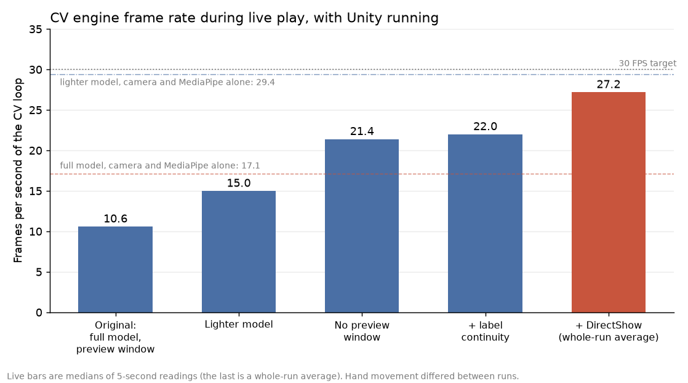
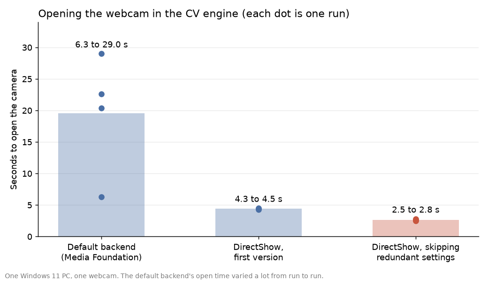
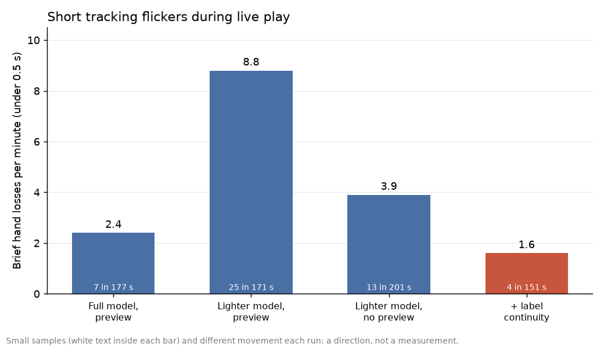

# Performance and measurements

Everything here was measured on one Windows 11 PC with one webcam (640x480 at 30 FPS requested) while MotionPlay was being built. These are development observations, **not controlled
benchmarks**: the hand movement differed from run to run, samples are small (minutes, not hours), and Unity was running alongside the CV engine in the live runs. Treat the numbers as a record
of what was seen and what changed, not as figures that will hold on another machine. The charts are regenerated by `python -m tools.make_performance_charts` from the values recorded in that file.

What has **not** been measured: end-to-end latency from hand movement to cursor movement (the packet timestamp cannot measure it, because the two programs do not share a clock), behaviour on other
cameras or lighting, long sessions, and CPU or memory use.

## Frame rate of the CV loop

| Setup (live play with Unity running) | Frames per second |
|---|---|
| Original: full MediaPipe model, preview window | 10.6 |
| Lighter model (`TRACKING_MODEL_COMPLEXITY=0`) | 15.0 |
| ...and no preview window | 21.4 |
| ...plus label continuity | 22.0 |
| ...plus DirectShow camera backend (average of a six-minute session) | 27.2 |

Live figures are medians of the engine's 5-second readings, except the last, which is a whole-run average. For reference, with Unity not running and no preview, the camera and MediaPipe alone ran at
**17.1 FPS with the full model and 29.4 FPS with the lighter model**. MediaPipe took about 50 ms per frame with the full model and about 27 ms with the lighter one; reading a frame from the camera took
only 3 to 4 ms, so the camera was never the bottleneck. The preview window cost roughly a third of the frame rate. In the first live run the loop reached about 10 FPS, which the later changes raised to the mid-20s.

## Opening the webcam

The CV engine's log (added in Phase 17) showed the camera taking **6 to 29 seconds** to open with OpenCV's default Windows backend (four runs: 6.3, 20.4, 22.6 and 29.0 s), and nothing, including Ctrl+C,
can interrupt it while it opens. Opening with DirectShow took about 1.2 s on its own in a standalone test, and 4.3 to 4.5 s inside the engine. Setting the resolution and frame rate cost about 1.4 s each on DirectShow,
even though the camera already reported 640x480, so the engine now skips settings the camera already has, giving **2.5 to 2.8 s**. Image size, frame rate and brightness were the same on both backends.

## Tracking stability

| Test | Result |
|---|---|
| 20 s, hand held still, right hand | Right label on 353 of 353 frames, 0 label flips, label confidence about 0.96 |
| 20 s, hand moving, full model | 19 frames labelled `left`, 8 flips, 17 below the confidence gate: 93% of frames usable for the right-hand control |
| 20 s, hand moving, lighter model | 7 `left`, 4 flips, 17 below the gate: 96% usable |
| Live play with label continuity | About 6% of frames needed a label correction (630 corrections in about 6 minutes) |

So the flicker appears when the hand **moves**, not when it is still. The charts below count brief losses (hand lost for under half a second) per minute in live play:

| Setup (live play) | Brief losses per minute | Events in the run |
|---|---|---|
| Full model, preview window | 2.4 | 7 in 177 s |
| Lighter model, preview window | 8.8 | 25 in 171 s |
| Lighter model, no preview | 3.9 | 13 in 201 s |
| Lighter model, no preview, label continuity | 1.6 | 4 in 151 s |

The samples are small (4 to 25 events each) and the lighter model with a preview window looked worse than the full model in that run (8.8 against 2.4 per minute), so this shows a direction at best: the
rate was lowest with label continuity (1.6 per minute). Longer gaps of 3 s or more were the player's hand leaving the view between rounds.

## Reliability and saving

- In the live sessions reviewed (about 40 rounds across several sessions), every round Unity sent was acknowledged and stored once; the log records each as `stored (...)`.
- Delivery uses up to 5 sends, 1 s apart, with an idempotent `session_id`, so a lost acknowledgement cannot create a duplicate. This was tested with simulated loss and unreachable receivers, not with a deliberately
  lossy network.

## Setup and build

| Step | Time |
|---|---|
| First `MotionPlay-Setup.cmd` (new environment, packages downloaded or cached) | about 4 minutes, mostly pip choosing compatible versions of MediaPipe's dependencies |
| Running setup again | about 22 seconds |
| Python test suite | about 30 to 65 seconds for 355 tests |
| C# test harness | under a minute for 118 tests |

## Test suite

355 Python tests with **96% line and branch coverage** (up from 89% when Phase 16 began), 118 C# tests that compile the same source files Unity runs, and a Python-to-C# UDP check. See [Phase 16](phase16_testing.md).
